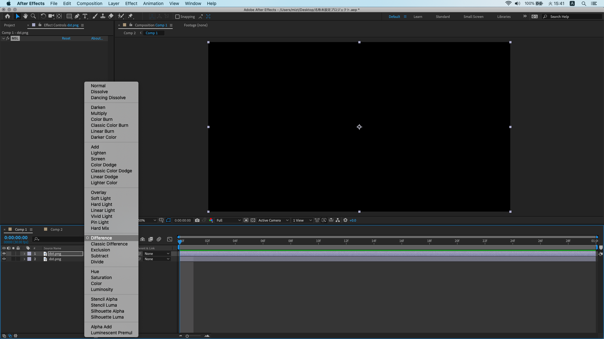
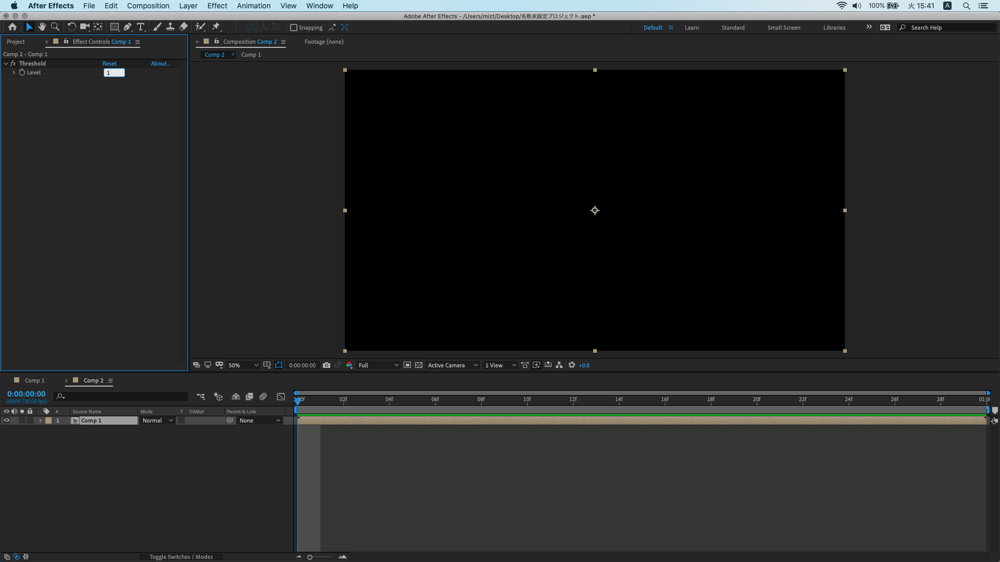

# MSL-AfterEffects-Plugin

[After Effects Plug-in SDK CC 2019 macOS Release 1(Latest)](https://console.adobe.io/downloads/ae)

Link metal.framework

### Note

Using `filter::linear` may result in a color error of 1.

Calculate the `Difference` between the filtered image and the original image.

If `Threshold > Level` to 	`0`, Find some white pixels.

But if `Threshold > Level` to `1`, everything goes black.

